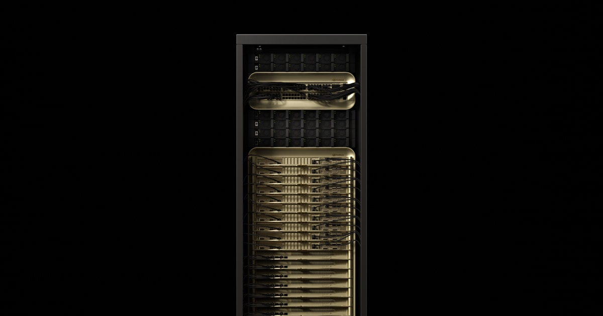

# NVIDIA GB300 NVL72 Bring-Up Lab

GB300 NVL72 is a system-scale AI supercomputer built for the part of AI that is getting more demanding every month: reasoning, long-context inference, multimodal generation, and high-throughput AI factory operation. Instead of treating GPUs as isolated accelerators, GB300 NVL72 brings the full environment into one tightly connected system with fast memory, Grace CPUs, NVLink, high-speed networking, and liquid-cooled infrastructure designed to run as a coordinated platform.

Image courtesy of NVIDIA. See the NVIDIA GB300 NVL72 product page for complete product details and current specifications.

## The Big Idea

The power of GB300 NVL72 is not only that it has a lot of GPUs. The magic is that the system is engineered so those GPUs can act together. NVIDIA positions GB300 NVL72 as a liquid-cooled platform with 72 Blackwell Ultra GPUs and 36 Grace CPUs. Fifth-generation NVLink ties the GPUs into a high-bandwidth scale-up domain, while ConnectX-8, Quantum-X800 InfiniBand or Spectrum-X Ethernet, and Mission Control help turn the environment into infrastructure that can be operated like an AI factory instead of a pile of individual servers.

That matters because modern AI workloads are increasingly interactive, stateful, and hungry for memory bandwidth. Reasoning models may spend more compute per answer. Video generation can process millions of tokens for just a few seconds of output. Agentic systems can call tools, retrieve data, inspect results, and refine answers in loops. GB300 NVL72 is built for that world.

## What Makes It Awesome

| Capability | Why It Matters |
|---|---|
| 72 Blackwell Ultra GPUs | A full accelerator domain for the biggest AI inference, training, and multimodal workloads. |
| 36 Grace CPUs | Arm-based host compute close to the GPUs for orchestration, preprocessing, data movement, and system services. |
| 37 TB fast memory | More room for large models, longer contexts, larger batches, and high-throughput serving. |
| 130 TB/s NVLink bandwidth | A scale-up fabric that lets GPUs communicate quickly across the system. |
| ConnectX-8 SuperNICs | High-bandwidth scale-out networking so systems can participate in larger AI factory fabrics. |
| Liquid-cooled design | Dense compute needs serious thermal engineering; GB300 NVL72 is designed as a complete system. |
| Mission Control integration | Operations, telemetry, automation, and resilience are part of the platform story, not an afterthought. |

## What You Can Do With It

- Run high-throughput inference for frontier reasoning models where response quality depends on more compute at inference time.
- Serve long-context assistants and agentic applications that need large memory, fast attention, and predictable responsiveness.
- Train and fine-tune massive language and multimodal models with high-bandwidth GPU communication.
- Generate high-resolution images and video for physical AI, simulation, digital twins, robotics, and synthetic data.
- Build AI factory environments where multiple teams can iterate on models, inference services, and data pipelines.
- Explore high-performance computing, simulation, analytics, and mixed precision workloads on a modern accelerated platform.

## Why This LaunchPad Environment Exists

This LaunchPad deployment gives you a fully prepared bastion for a GB300 NVL72 environment without triggering operating system installation on the hardware. That is useful when the system is being staged, inspected, cabled, validated, or prepared for a manual bring-up path.

If this is your first time opening the environment, start with [Start Here](start-here.md). It walks through the first operational steps: find the control-plane BMC IPs, run **Resources > SSH Setup**, copy any required ISO to the bastion, open the BMC from the bastion desktop, mount the ISO, and install the control-plane OS.

The bastion provides the supporting services and documentation that make the environment approachable:

- Hardware and access details for the selected system.
- Bastion-hosted documentation, desktop tools, and SSH access for starting the bring-up path.
- Access tooling, including web desktop and SSH console entry points.
- Rendered hardware tables for switches, power shelves, control-plane nodes, WEKA storage, compute trays, and NVLink management.

## Useful Product References

- [NVIDIA GB300 NVL72 product page](https://www.nvidia.com/en-us/data-center/gb300-nvl72/)
- [NVIDIA Mission Control](https://www.nvidia.com/en-us/data-center/products/mission-control/)
- [NVIDIA NVLink and NVLink Switch](https://www.nvidia.com/en-us/data-center/nvlink/)
